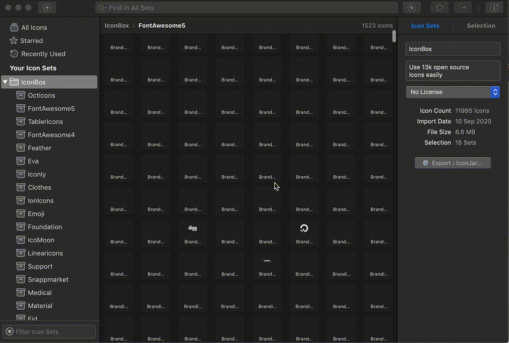

<a href="https://iconbox.space" target="_blank">
    

        
    

  <h1 align="center" style="color:#ff0000; font-size:12px;">🧙 IconBox</h1>
</a>

     IconBox integration with iconjar
     

> You can easily install iconjar app in your system and use 13k icons easily.

### 🎪 Get Iconjar 
Get it from there official website: https://geticonjar.com/

Then you can download and import <a href="https://github.com/iconsbox/iconjar-integration/raw/master/iconbox.iconjar.zip">`iconbox.iconjar`</a> file into your iconjar.

    

